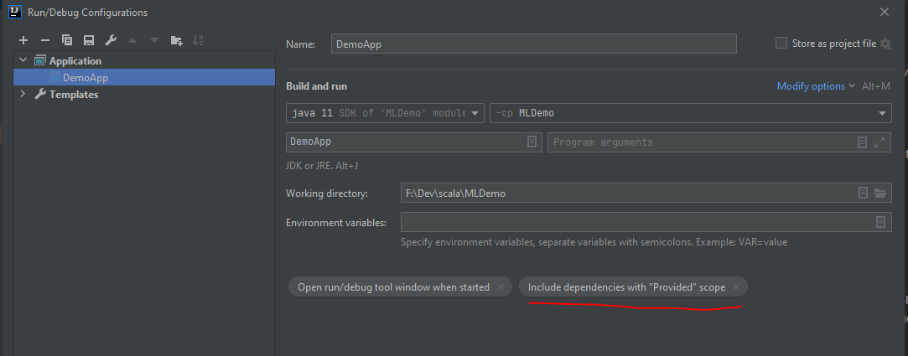

# Spark ML Demo

## Setup Spark
Important make sure to have correct PATH variables and stuff. 

- [Setup Spark](https://medium.com/analytics-vidhya/getting-set-up-with-intellij-git-java-and-apache-spark-c6b6272dc3c0)
- [Setup Spark](https://sparkbyexamples.com/)

I use OpenJDK11 and have the following path variables

__User Variables:__
- JAVA_HOME -> C:\openjdk11
- Path: %JAVA_HOME%\bin

__System Variables:__
- HADOOP_HOME -> F:\dev\spark3-bin-hadoop2.7
- SPARK_HOME -> F:\dev\spark3-bin-hadoop2.7
- Path: %HADOOP_HOME%\bin

To run the project with spark submit and also in IntelliJ I did change the Configuration in IntelliJ with 
"include dependencies with provided scope".

